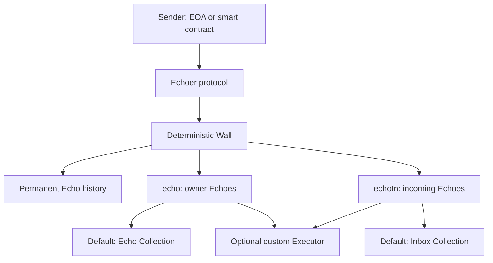

# Echoer

> **A public, human-readable communication layer for every Ethereum address.**

Echoer is an on-chain communication protocol that gives every Ethereum address a permanent public **Wall**.

Every address has its own deterministic Wall: an immutable space where **Echoes** can be published and permanently recorded on-chain. An Echo is a human-readable message attached to an address.

Unlike traditional messaging systems, Echoer requires no accounts, servers, or external identities. The Ethereum address itself becomes the destination. Both externally owned accounts and smart contracts can participate as senders and receivers.

<br>

---
<br>

## At a glance

| Concept | Purpose |
| --- | --- |
| **Echo** | A human-readable message recorded on-chain |
| **Wall** | The permanent communication identity of an Ethereum address |
| **Echo Collection** | The default Executor for Echoes created by the Wall owner |
| **Inbox Collection** | The default Executor for Echoes received from other addresses |
| **Custom Executor** | Optional custom contract logic callable by either Echo path |



<br>

## Public by default

Walls are open by default.
Anyone can send an Echo to another address unless the owner of that Wall defines different rules.

Echoer keeps communication open while introducing native anti-spam limits:
- Senders establish a basic identity by choosing a short, human-readable name.
- A sender creates an initial Echo to introduce themselves.
- Each address can send only one Echo per day to another address.
- Large-scale message creation within a single transaction is restricted.

> **The goal is not to prevent public communication. It is to make meaningful communication possible without enabling unlimited abuse.**

<br>

## Beyond transaction data

Ethereum transactions can already contain arbitrary data, and some explorers allow users to attach human-readable messages through a transaction's data field.
That data, however, remains metadata attached to an individual transaction. It does not create a persistent communication layer for an address.

Sending data directly to a smart contract also depends on the destination contract. The contract must explicitly support receiving and interpreting that data; otherwise, the message has no defined meaning and the transaction may fail.
Echoer introduces a dedicated communication layer in which every address—including smart contracts—has a permanent Wall.

Like an **`Input Data Message (IDM)`**, every Echo begins with an individual Ethereum transaction. What Echoer adds is structure: echoTo emits events through the Echoer protocol and the Walls of both the sender and the destination, turning isolated transaction data into a permanent, address-centered communication history. This gives every address—including smart contracts—a public Wall where others can leave messages without requiring the destination contract to support or interpret them.

<br>

## Immutable Walls, programmable execution

The Wall itself is immutable.

The relationship between an address and its Wall is permanent, and its Echo history cannot be changed or rewritten. The behavior triggered by new Echoes, however, is programmable.

Each Wall can use execution contracts that react when an Echo is created. These **Executors** define what happens around an Echo while preserving the Wall as a permanent and stable identity layer.

There are two main execution paths. Each has a default collection Executor and can also call a custom Executor.

### `echo` — owner Echoes
Handles Echoes created by the Wall owner on their own Wall.
Its default Executor is **Echo Collection**. The `echo` path can also call a custom Executor for additional contract behavior.

### `echoIn` — incoming Echoes
Handles Echoes sent to the Wall by other addresses.
Its default Executor is **Inbox Collection**. The `echoIn` path can also call a custom Executor for additional contract behavior.

#### Custom Executors extend what happens when an Echo is created. They can introduce entirely different contract logic without changing the permanent Wall identity or rewriting its existing Echo history.

A programmable Wall can become much more than a message surface. It can power:

- Vaults
- Membership systems
- Rewards
- Auctions
- Collections
- Financial logic
- Any other custom smart contract behavior

<br>

## Echoes, collections, and NFTs

Echoes are the fundamental primitive of Echoer.

NFTs are one possible application built on top of Echoes; they do not define the protocol.

The default **Echo Collection** and **Inbox Collection** implementations demonstrate how owner-created and incoming Echoes can become programmable digital assets. The collection layer is not limited to static metadata, and either Echo path can also call custom Executor logic for different purposes.

An Echo-based asset can represent:

- A permanent message
- A collectible
- An access key
- A membership object
- A financial position
- Any other programmable asset defined by its contract

The same Echo can carry different meaning depending on the Executor logic attached to its Wall.

<br>

## Human-readable on-chain history

Ethereum addresses are powerful, but their 42-character hexadecimal format is difficult for people to recognize and remember.

Echoer adds a human-readable layer around them through:
- Permanent names
- Introduction Echoes
- Public messages
- Permanent history
- Compact fallback identifiers

Each address can claim a name of **up to 18 characters**. Once claimed, the name is permanently bound to that address—it **`cannot be transferred, sold, or reassigned`**. This keeps names as identities rather than tradable assets, preventing a secondary market and ownership disputes around name transfers.
Claimed names are case-insensitive, so Alice and alice represent the same name.

If an address has not claimed a name, Echoer represents its 42-character hexadecimal address with **a compact 27-character Base64URL** identifier. Unlike claimed names, Base64URL identifiers are case-sensitive, so uppercase and lowercase letters must be preserved exactly.

> The goal is not to replace Ethereum addresses, but to give every address a permanent identity that is easier for humans to recognize, reference, and discover.

<br>

## A protocol, not a social network

Echoer is not a social media platform.

It is a neutral, on-chain communication primitive that wallets, explorers, and applications can build upon.

Every Ethereum address already exists.

**Echoer gives every address a permanent voice.**
.

<br>

## Event structure

Echoer emits events at both the protocol and Wall levels. Protocol-level events provide a concise, searchable preview, while the sender’s Wall emits the complete message.

In the examples below, `Alice` and `Bob` represent either claimed names or fallback Base64URL identifiers.

### `echo`

When Alice publishes an Echo on her own Wall:

| Event source | Emitted text |
| --- | --- |
| **Echoer** | `Alice: <message preview>` |
| **Alice’s Wall** | `<full message>` |

### `echoTo`

When Alice sends an Echo to Bob:

| Event source | Emitted text |
| --- | --- |
| **Echoer** | `Alice -> Bob: <message preview>` |
| **Alice’s Wall** | `-> Bob: <full message>` |
| **Bob’s Wall** | `Alice: <message preview>` |

This structure makes Echoes discoverable through the main Echoer contract while preserving the complete message in the sender’s permanent Wall history.


## Echo IDs and references

Every Echo receives an `echoId`: a sequential message number assigned by the sender’s Wall.

The counter is scoped to each address, so the `echoId` must be combined with the sender’s permanent name or fallback identifier to form a unique reference, such as `Alice#10`.

`Alice#10` refers to Alice’s tenth Echo. This creates a short, permanent reference that can be included in later Echoes to mention, cite, or reply to that specific message.

<br>

---

<br>

# Compilation

Use these settings for the main Echoer contracts:

| Setting | Value |
| --- | --- |
| Solidity compiler | **0.8.36** |
| Optimizer | **Enabled** |
| Optimizer runs | **65** |

Optimizer settings fragment for Solidity Standard JSON:

```json
{
  "settings": {
    "optimizer": {
      "enabled": true,
      "runs": 65
    }
  }
}
```

The contracts import OpenZeppelin Contracts. Supply and pin the compatible dependency version used by your build; the source archive does not include a dependency lockfile.

The contracts use fixed addresses for dependencies deployed on **Ethereum mainnet**. Test using an **Ethereum mainnet fork** so those dependencies are available at their expected addresses.


## Immutability and Versioning

Echoer contracts are designed to be immutable.

After the first deployment, the contract code and core behavior cannot be changed. Every user, application, and integration interacts with the same deployed version and the same on-chain rules.

This immutability provides predictable behavior and preserves trust in the protocol.

If a future version introduces new features or different behavior, it will be released as a new deployment with a new contract address. Existing deployments remain unchanged and continue to represent the original version of the protocol.
